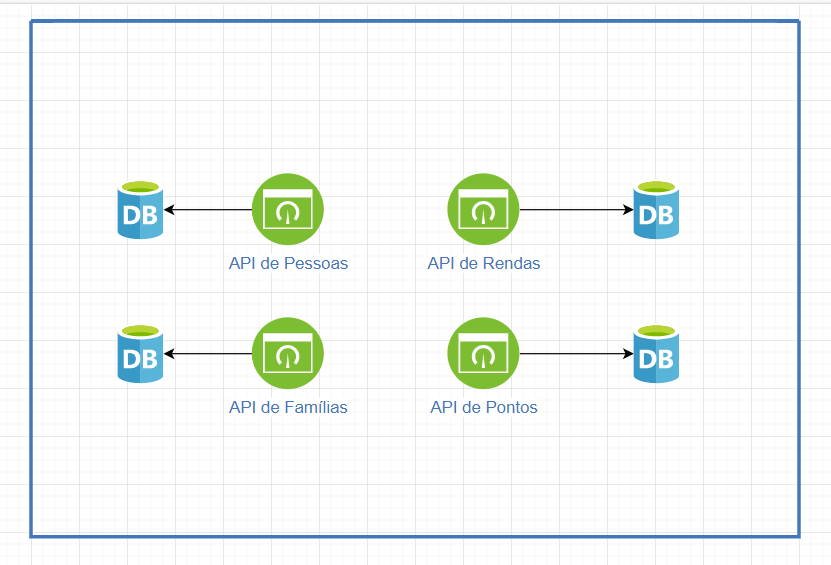
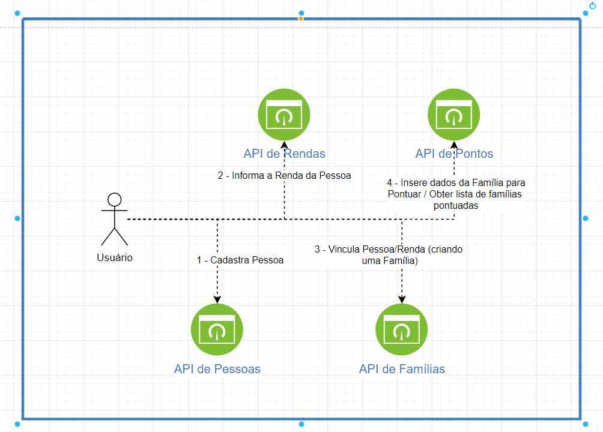
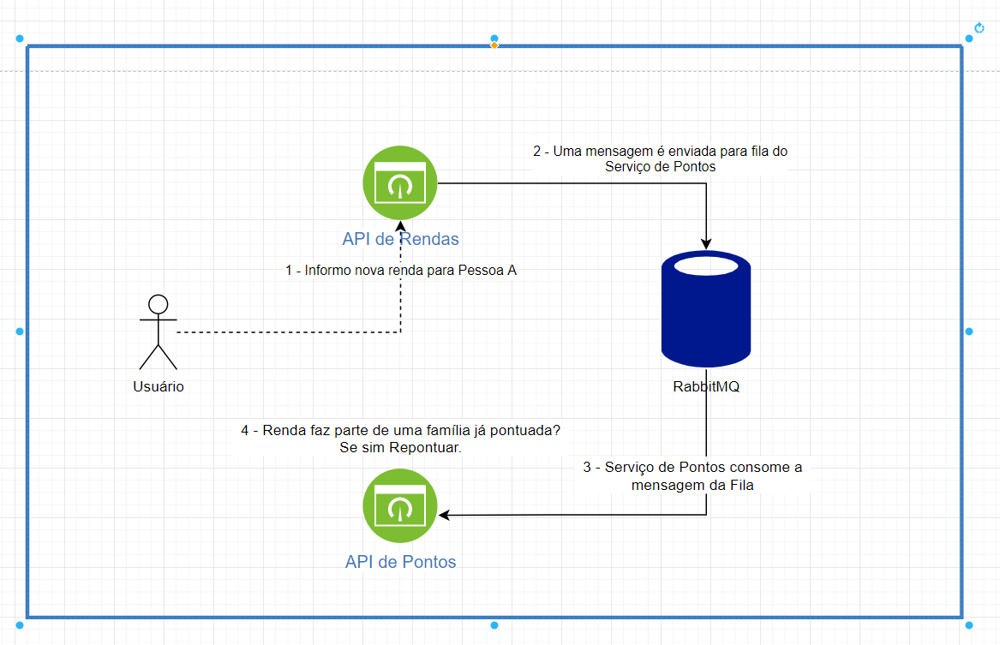

### Desafio App para sorteio de casas

* A aplicação consiste em uma sério de serviços que tratam de escopos desacoplados.
* O objetivo final é ordenar famílias pela pontuação (maior melhor) para que sejam contempladas com uma casa popular.

### Arquitetura adotada

* Arquitetura dos serviços:

* Do ponto de vista prático, quebrando em serviços podemos ter: 
  * Serviço de Pessoas:
    * Responsável pelo cadastro básico de pessoas.
  * Serviço de Rendas:
    * Responsável pela gestão da renda por pessoa.
  * Serviço de Famílias:
    * Responsável por gerir as pesssoas que fazem parte de uma família e suas respectiva renda vinculada.
  * Serviço de Pontos:
    * Responsável por classificar a pontuação das famílias com base nas regras de negócio.

* Exemplo de ciclo de vida até a pontuação da família:

* Para manter a independência dos serviços, alguns dados foram propositalmente duplicados. 
* A separação das responsabilidades em serviços diferentes requer uma constante atualização dos dados.
  * Exemplo: Se informo uma nova renda para uma pessoa, essa renda deve refletir na pontuação da família a qual faz parte.
* Afim de ofertar uma solução para sincronia dos dados foi implementado uma solução de fila para comunicação entre os serviços.

### Qualidade da solução

* Para garantir o mínimo de qualidade da solução ofertada, testes de unidade foram implementados para cobrir as principais regras negócio.
* Também fora implementado uma série de testes funcionais para simular as chamadas das APIs em um banco de teste. Esse tipo de teste - apesar de mais custoso - visa garantir a cobertura da solução de modo mais próximo ao que o usuário final terá acesso.

### Para onde progredir?

* Várias implementações poderiam ser aprimoradas:
  * Total containerização das aplicações (esboço iniciado).
  * Solução para builds automatizados, no github actions talvez.
  * Orquestração das aplicações para tolerar falhas e simplificar o deploy.
  * Melhor cobertura de testes de unidade (principalmente nos requisitos não explícitos no desafio).

